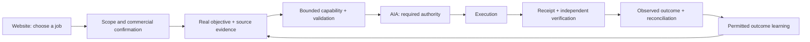

# OrPaynter, Inc.

**By Oliver Paynter · [@orpaynter](https://github.com/orpaynter)**

OrPaynter is building a governed AI workforce that turns a real objective into evidence-bound work, authorized execution, a verified outcome, and a useful next cycle. Its website is the product front door: help a visitor identify a job, inspect the relevant proof, request a scoped engagement, and return to a record of the work.

- [Products and services — orpaynter.com](https://www.orpaynter.com/products)
- [Products and services — orpaynter.ai](https://orpaynter.ai/products)
- [Continuous construction](https://www.orpaynter.com/construction)
- [World Portal](https://www.orpaynter.com/world-portal)

This is a company and product model, not a claim of booked revenue, complete autonomous operation, market exclusivity, or proven demand. Every service requires its own delivery evidence and confirmed commercial scope.

## The core concept

A customer needs an outcome. The system gathers the relevant source material, identifies a gap, selects or constructs a bounded capability, tests it, resolves authority, executes within the approved scope, and preserves the result. Verified outcomes can inform subsequent work; learning cannot grant itself more control.

The same pattern can support a contractor claim, a project workspace, a company workflow, or a monitored operation. Roofing and ClaimFlow are the first proving ground. They do not define the limits of the company.

## One company, distinct responsibilities

| Component | Responsibility | Boundary |
| --- | --- | --- |
| Website | Discovery, product explanation, inquiry, proof and eventual customer return path | An inquiry is not an accepted order or a payment |
| World Portal / Overlay | Place, time, public signals and preserved context | A visualization is not a survey, measured CAD or execution authority |
| AIA | Canonical objective, policy, approval and durable execution records | Workers and public pages cannot approve their own consequences |
| Specialist workers / MAS swarm | Bounded tasks, dependencies, capability candidates and tests | Agent activity is not a verified outcome |
| ClaimFlow | Initial evidence and contractor workflow application | A synthetic demo is not a customer result or carrier determination |
| Recovery | Retry, reconstruct or stop within declared scope | Recovery must not duplicate consequences or expand access |
| Learning | Evaluate permitted adjustments against observed results | Retain unknowns, failed gates and unchanged authority |

## Commercial starting points

| Path | Buyer and deliverable | Revenue mechanism | Current position |
| --- | --- | --- | --- |
| ClaimFlow evidence package | Contractor; reviewable evidence-linked draft and workflow | Fee per package; any additional fee confirmed in written terms | Existing proposed base price is $249. Demo is synthetic; delivery and payment require operator confirmation |
| Workflow implementation | Business; one connected process with acceptance checks | Scoped discovery and implementation fee | Inquiry path; full live loop acceptance remains in progress |
| World Portal project workspace | Project team; source-grounded spatial workspace | Setup, hosted operation and support | Local open-source build exists; hosted multi-user service requires separate proof |
| Managed continuity | Operator; bounded monitored workflow and recovery record | Recurring support fee with explicit service boundaries | Local recovery has evidence; no production uptime commitment established |

These four paths are the website's initial product inquiries. New pricing and recurring commitments are not silently introduced.

## Additional revenue hypotheses to validate

The core can support more offers when demand and delivery earn them:

1. **Connector implementation:** paid setup of scoped integrations and evidence lineage around an existing customer workflow.
2. **Team workspaces:** recurring hosted access after tenant isolation, customer operation, privacy, billing and support are verified.
3. **Partner packages:** implementation and support for another company's use of the core; contributor notices and upstream rights stay intact.
4. **Evidence and outcome reports:** fee per verified work package or agreed reporting cycle; no claim of licensed professional determination unless actually provided.
5. **Operational support and training:** bounded support contracts, setup and onboarding around workflows the company can already demonstrate.
6. **Specialist capability services:** fee for an agreed adapter, artifact or workflow improvement, accepted against a fixed test and customer outcome.

These are hypotheses, not existing products or revenue. Open-source code alone is not a promise of exclusive licensing rights. Paid value can come from implementation, hosted service, support, integrations and delivered outcomes.

## The website's delivery job

Every product page should answer: who is this for, what work will be delivered, what evidence exists, what is the commercial path, and what action starts it?

The initial action uses the existing inquiry service, with an email fallback. Form-service acceptance does not prove inbox receipt, accepted scope, checkout, fulfillment or revenue. The operator confirms those steps. No customer credentials, card details, private case records or raw company captures belong in the public repository.

The next commercial proof is one attributable request, one accepted written scope, the existing secure payment path when ready, one delivered artifact, and one independently verified customer outcome. Track these as separate events. A website deployment is not a sale.

## Completion and learning evidence

Canonical AIA admission is now live in a protected engineering preview with persistent storage. The real owner's objective survives redeployment and reconstructs its evidence chain. A real readiness observation completed a six-stage deterministic analysis workflow. The bounded execution, receipt, verification, reconciliation and learning bridge is deployed and tested. The owner approved the first exact packet, and Cycle N executed with persisted, independently reconstructed output and learning. A fresh second package has adopted that learning and awaits its own review; full GACC acceptance remains blocked.

See [the live AIA proof snapshot](LIVE_AIA_LOOP_PROOF.md) and [the existing recovery build report](BUILD_REPORT.md). No claim of being first, bulletproof, continuously self-improving, or a new market category is established by these mechanisms.

## Authorship, contribution and credit

The OrPaynter concept and original company contributions are presented as **OrPaynter, Inc. by Oliver Paynter / @orpaynter**. The globe foundation comes from **OSIRIS by simplifaisoul and contributors**, pinned at `4ba7184ff31db06cb33c47de029c2d4255806458`. Original upstream authorship, the MIT notice, library licenses and provider terms remain intact. OrPaynter does not claim authorship of that foundation or ownership of outside data.

[Contributor credits](../../CREDITS.md) · [Upstream MIT license](../../LICENSE) · [Original OrPaynter contribution license](../../LICENSE_ORPAYNTER)
